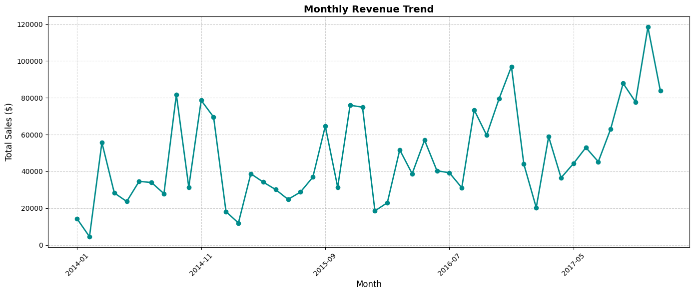
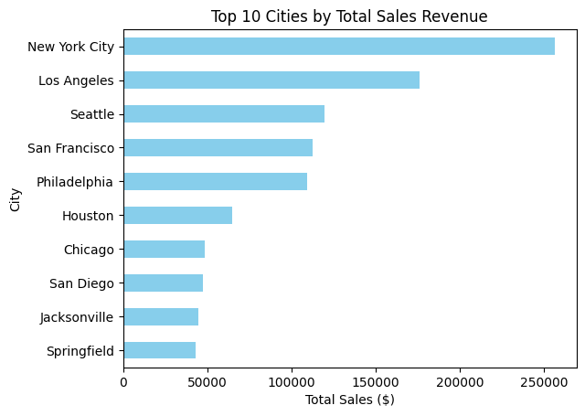
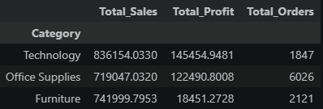

# E-Commerce Sales Analysis

Python | Pandas | Matplotlib | Jupyter Notebook | Git

## Project Overview

This project analyzes retail sales data using Python and Pandas to uncover business insights, calculate KPIs and visualize sales performance.

The project follows a complete data analysis workflow:

- Data Loading
- Data Cleaning
- Exploratory Data Analysis (EDA)
- Business Analysis
- KPI Calculation
- Data Visualization
- Cleaned Dataset Export

---

## Dashboard Preview

### Monthly Revenue Trend



---

### Top 10 Cities by Sales



---

### Profit by Category



---

## Technologies

- Python
- Pandas
- Matplotlib
- Jupyter Notebook
- Git
- GitHub

---

## Business Questions

- Which cities generate the highest revenue?
- Which product category is the most profitable?
- Who are the top customers?
- How do sales evolve over time?
- What are the company's key KPIs?

---

## KPIs

- Total Revenue
- Total Profit
- Profit Margin

---

## Project Structure

```text
E-Commerce Sales Analysis/
│
├── data/
├── notebooks/
│   └── sales_analysis.ipynb
├── outputs/
│   └── cleaned_dataset.csv
├── README.md
├── requirements.txt
└── .gitignore
```

---

## Dataset

Sample Superstore Dataset (Kaggle)

---

## Author

George Papachatzakhs
